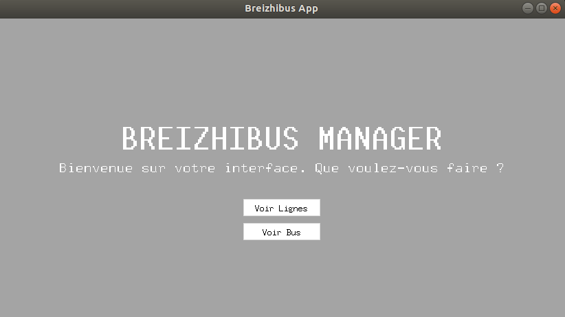
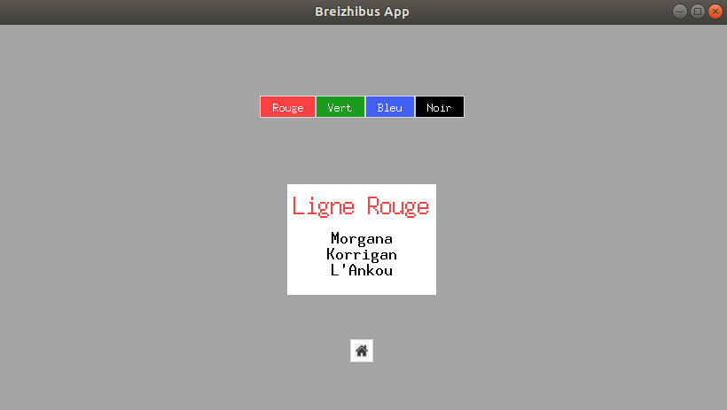
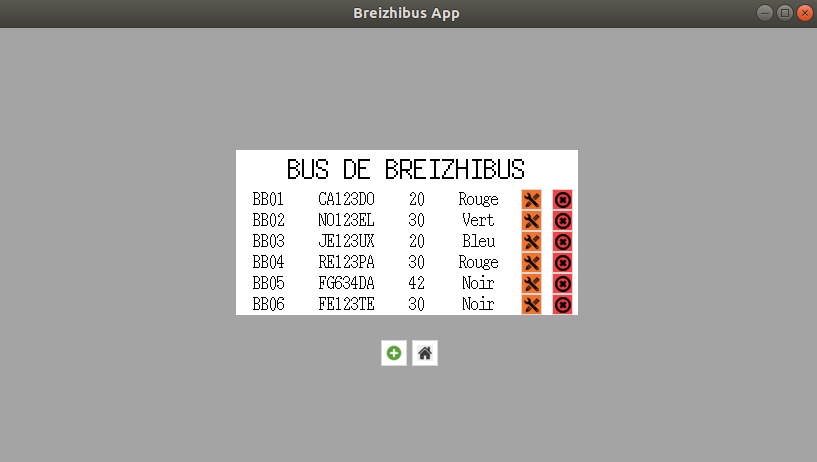
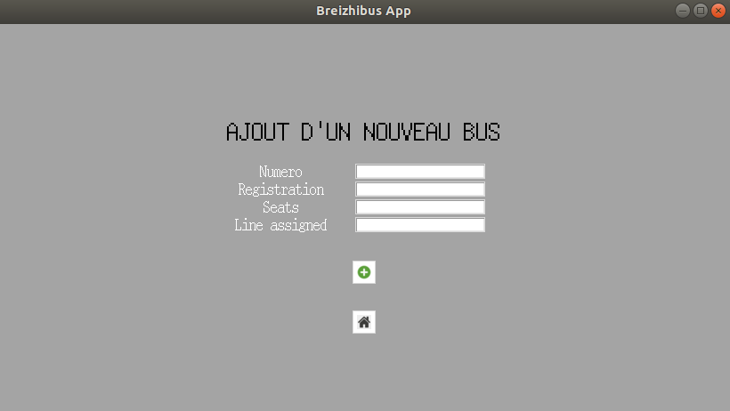
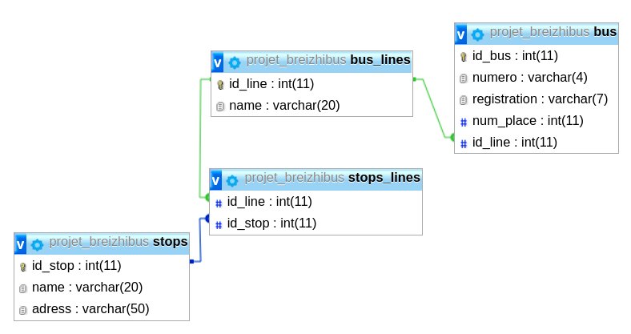

# Projet Breizhibus

Thomas Chaigneau

---

Projet lié au brief Simplon `Breizhibus, gestion de lignes de bus`.  
Nous détaillerons dans un premier chapitre le fonctionnement de l'application, dans un second nous expliquerons les choix techniques.   
Enfin, dans un dernier point nous présenterons les difficultés rencontrées et leurs solutions.

---

## 1. Présentation de l'application

L'application se compose de 4 pages différentes.  

- <ins>La page d'accueil :</ins>



Cette page dispose de deux boutons qui permettent de naviguer dans l'application.    
Un bouton pour pouvoir afficher les différentes lignes et les arrêts associés.   
Un autre bouton permettant d'afficher tous les bus de la compagnies.   

- <ins>La page des lignes de bus :</ins>



Chaque ligne dispose de son bouton personnel pour afficher les arrêts qui lui sont liés.

- <ins>La page des bus :</ins>



Toutes les informations des bus sont listées dans le tableau.   
Chaque bus dispose de deux boutons :   
    - `modifier` : ce bouton permet de modifier les informations d'un bus et de sauvegarder les changements dans la base de données    
    - `supprimer` : ce bouton permet de supprimer un bus de la base de données   

Le bouton `+` permet d'accèder à la page d'ajout de bus.   

- <ins>La page d'ajout de bus :</ins>



Cette page est accessible via le bouton `+` qui permet d'ajouter un bus.   
Si le numéro du bus existe déjà dans la base de données, le bus ne sera ajouté mais modifié directement dans la ligne liée.   

## 2. Choix techniques

- <ins>MySQL :</ins>  

J'ai choisi `MySQL` pour la base de données.  
Voici le plan de ma base de données :   


- <ins>Tkinter :</ins>

J'ai choisi `Tkinter` pour l'interface graphique.  
J'ai organisé chaque pages en `class` python pour faciliter le changement de pages et la fluidité pour l'utilisateur.   
Chaque page hérite de cette super classe `class Page()`:   

```python
class Page():

    def __init__(self):
        self.container = Frame(app_frame, bg=colors["BG"])
    
    # Méthode pour cacher la frame
    def close_frame(self):
        self.container.pack_forget()

    # Méthode pour montrer la frame
    def show_frame(self):
        self.container.pack(expand=YES)
```

## 3. Difficultés rencontrées

J'ai eu quelques difficultés pour lier les boutons de modification et de suppression des bus à un bus en particulier dans la boucle de création dans l'interface.  
J'ai résolu ce problème en utilisant une fonction `lambda` dans l'attribut `command`lors de la création des boutons.

```python
command=lambda b=self.show_bus:self.edit_bus(b)
```